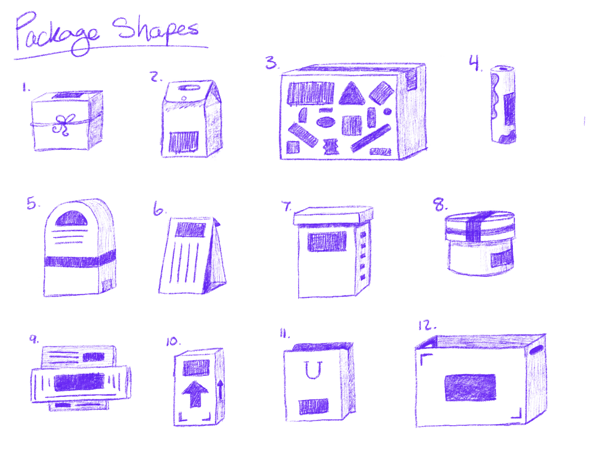
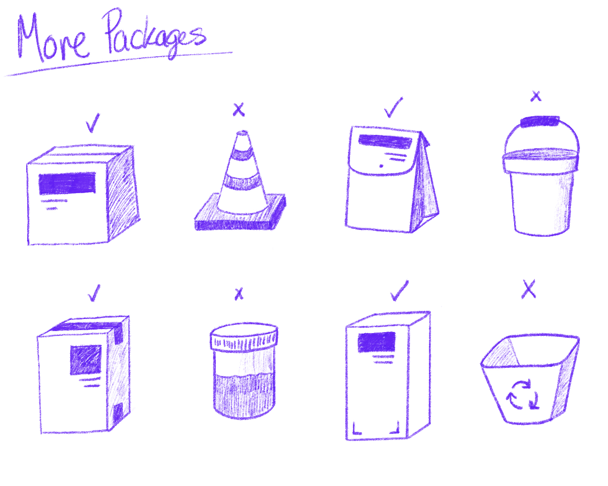
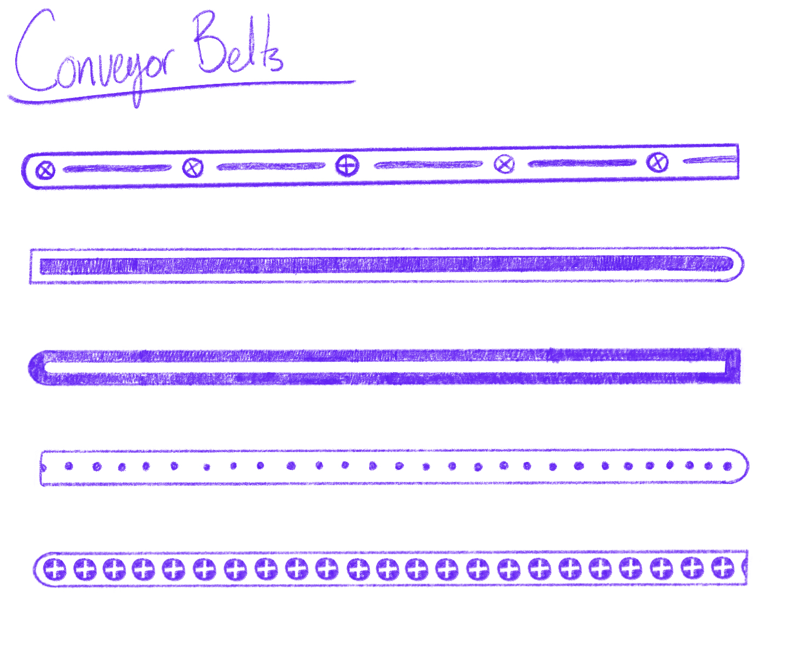

# Out-of-Sight | Documentation!
***A Hidden-Object Game Idea (emphasis on 'Idea')***

## Precedence Research - [A Building Full of Cats](https://store.steampowered.com/app/1969080/A_Building_Full_of_Cats/)

## Precedence Research - [Hidden Folks](https://hiddenfolks.com/)

## Precedence Research - [Find All (2)](https://store.steampowered.com/app/1722520/FIND_ALL_2_Middle_Ages/)

## Precedence Research - [Tiny Lands](https://store.steampowered.com/app/1354910/Tiny_Lands/)

## Out Of Sight! | Initial Playground Build | 08.11.22
***Even more emphasis on ideas***

###  A New Exploration

After many nights thinking about how this might look, we have landed on trying a "playground" version of this that amounts to a step sequencer.
The idea is this:
* Present the factory as a single screen
* This screen has 4 conveyor belts transferring goods from one side of the screen to the next
* As these good hit the tube apparatus they play a randomized note
* The player needs to remove "wrong" packages from the belt to increase their success-rate thereby adding positive musical effects

### Success?

* The musical track is built and it seems like it will actually work really well with this idea. Also, it feels like a straight up, *jam* but.. we're biased
* This version has a conveyor belt transporting goods from right to left. You can click on the goods to remove them, and there is a counter that acknowledges "proper" vs "improper" goods. We'll need to make this more flexible, but it's a start

<video controls><source src="Media/proto_08_11.mov" type ="video/mp4"></video>

### Next Steps

* Integrate music into this iteration - then we'll get a better idea if the rhythm works (and how to use FMOD to control tempo)
* There's a lot more that needs to be done, but this has to happen first before it's even possible to think about those steps

## Music Integration into Unity & FMOD | 10.11.22

### Beat Matching!

Using ColinVAudio's [Beat Tracking Tutorial](https://www.youtube.com/watch?v=hNQX1fsQL4Q) we have made a visually-simple outline of this experience.
There is actually a lot here, and it took forever. The beat matching works very well, which is great. The speed can be increased as well as the spawn rate, and all of this stays on the beat of the FMOD project.
Let's get right into the next steps, since they are on the brain.

### Next Steps
* There already is a "point" system where proper items award points and improper items subtract points, but this needs to be tied to musical parameters.
  Working in FMOD, develop interesting BAD and GOOD effects to influence and reward the removal of bad items.
* Explore the possibility of increases in tempo. Not sure if this is possible in FMOD (or if it is all that necessary, even)
* Add screen-based controls and visuals for tempo, beats, spawn-rate, and points (for each conveyer belt)
* Add on/off controls for each conveyer belt
* Once the next stage is done (specifically the screen-based controls) a prototype will be uploaded here for testing sake.

### Thoughts
* [Zspace](https://github.com/zSpaceSheikh) is going to work on visuals, which will surely work to seel the concept
* Right now this is horizontal, but perhaps a vertical layout is better?
* It's pretty extendable right now, which feels great. There is the possibility to use completely different songs with the exact same framework

## HTML5 Build v 1.2 | 12.11.22

<video src="https://user-images.githubusercontent.com/8988958/201481491-6cdde665-fc56-49e8-a525-ab87610d4fe4.mov" controls="controls" muted="muted"></video>

### It's Live

Some simple shapes. Some beats. Some controls. Pretty much what's on the tin.

Play the [Out of Sight Version 1.2 WebGL Build](https://mouseandthebillionaire.github.io/outOfSight/Builds/v1.2/)

### ALSO! [Zspace](https://github.com/zSpaceSheikh) Art

### Next Steps
We need to make this more "gamey." The purple "bad" items are being created, but don't communicate anything to the player 
  (though we _are_ keeping track of the score behind the curtain) Let's...
* Show the score visually
* Make a "bad" noise when the wrong item goes in
* Eventually perhaps evolve the music positively/negatively based on score milestones

Let's also get this art in there. Boom!

## You've Got ART! | 12.11.22

Who needs sleep when there's art to be made. And packages to click when they're red and make booshy noises to mess up your otherwise sweet jamz?

<video src="https://user-images.githubusercontent.com/8988958/201488160-24350fec-7784-4460-8ca3-d0f783f0ddab.mov" controls="controls" muted="muted"></video>

Play the [Out of Sight Version 1.3 WebGL Build](https://mouseandthebillionaire.github.io/outOfSight/Builds/v1.3/)

### Next Steps
* More evolution based on score milestones
* Explore if it's possible to assign specific note to multi-instruments in FMOD
* Sleep

